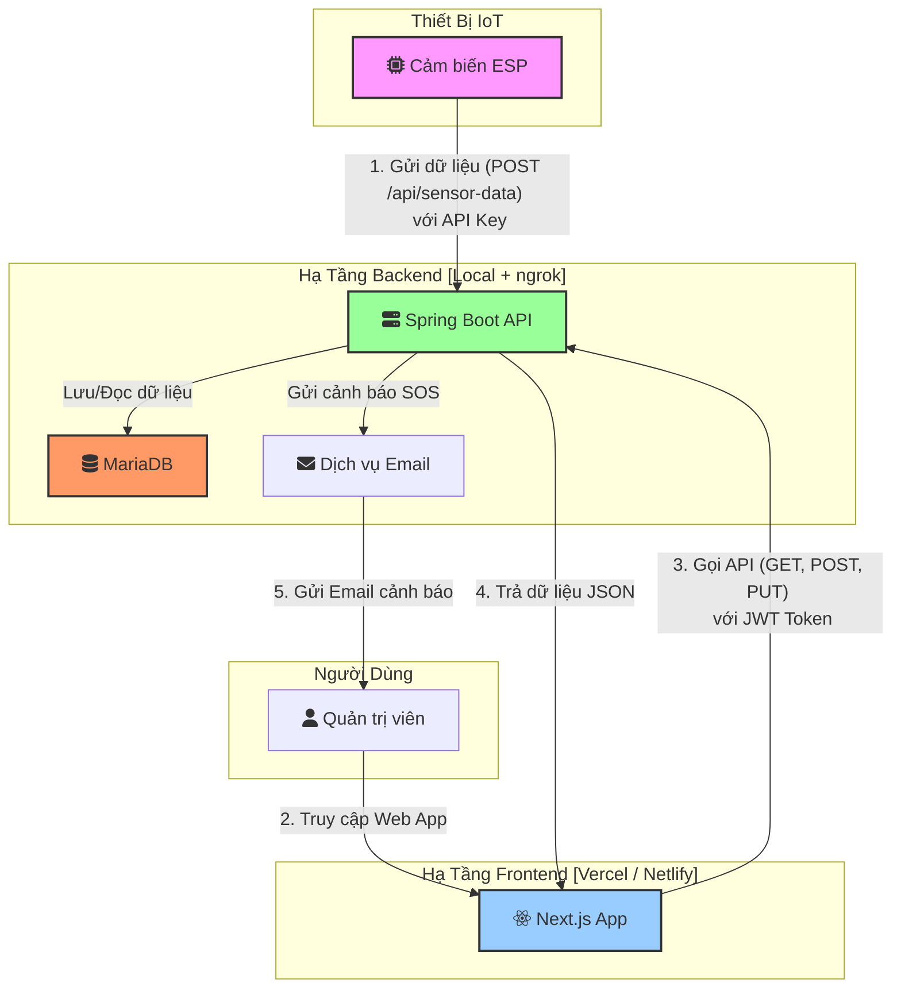

# **Tài Liệu Phân Tích Dự Án: Hệ Thống Giám Sát Chất Lượng Nước**

## **1. Giới Thiệu Dự Án**

Dự án "Hệ thống giám sát chất lượng nước" là giải pháp phần mềm dùng để thu thập, phân tích và cảnh báo về các thông số chất lượng nước trong nhà máy. Hệ thống kết nối với các cảm biến ESP để theo dõi các chỉ số quan trọng, giúp quản lý và đảm bảo chất lượng nguồn nước đáp ứng tiêu chuẩn.

## **2. Mục Tiêu Dự Án**

Xây dựng hệ thống giám sát chất lượng nước toàn diện với khả năng:

- Thu thập dữ liệu thời gian thực từ cảm biến.
- Phân tích và cảnh báo khi vượt ngưỡng an toàn.
- Điều khiển thiết bị (van cấp nước) từ xa.
- Cung cấp giao diện trực quan cho người quản lý.

## **3. Yêu Cầu Chức Năng**

### **3.1. Dữ liệu cảm biến ESP**

Hệ thống sẽ nhận dữ liệu từ cảm biến ESP với cấu trúc JSON sau:

```json
{
    "ph": float,
    "temperature": float,
    "doDuc": float,
    "doDanDien": float
}
```

**Phạm vi tiêu chuẩn (cho mục đích dự án tốt nghiệp):**

- pH: [6.0, 9.0] (an toàn)
- Nhiệt độ: [20.0, 30.0] °C
- Độ đục: NTU
- Độ dẫn điện: μS/cm

### **3.2. Các tính năng chính**

1.  **Hệ thống cảnh báo hai cấp độ**

    - **Cảnh báo thông thường:** Tự động phát hiện khi các thông số vượt ngưỡng an toàn và hiển thị cảnh báo dạng _notification_ trực tiếp trên giao diện website sau khi người dùng đăng nhập.
    - **Cảnh báo khẩn cấp (SOS):** Hệ thống sẽ kích hoạt tính năng SOS và gửi cảnh báo khẩn cấp qua **email** đến tài khoản admin khi phát hiện một chỉ số vượt ngưỡng nghiêm trọng trong một khoảng thời gian liên tục.
        - **Thuật toán:** Backend sẽ chạy một tác vụ kiểm tra định kỳ (ví dụ: mỗi phút một lần).
            1.  **Định nghĩa Ngưỡng Nghiêm Trọng:** Các ngưỡng này được cấu hình riêng (ví dụ: pH < 5.5 hoặc > 9.5).
            2.  **Quét dữ liệu:** Tác vụ sẽ lấy tất cả dữ liệu cảm biến trong **5 phút** gần nhất.
            3.  **Kiểm tra điều kiện:** Nếu **tất cả** các giá trị của một chỉ số trong khoảng thời gian trên đều nằm ngoài ngưỡng nghiêm trọng, hệ thống sẽ coi đây là một sự kiện SOS.
            4.  **Gửi cảnh báo & Áp dụng thời gian nghỉ:** Nếu một sự kiện SOS xảy ra và chưa có cảnh báo nào được gửi trong "thời gian nghỉ" (ví dụ: 30 phút), hệ thống sẽ gửi email và ghi nhận lại thời điểm này để tránh spam.

2.  **Điều khiển van cấp nước**

    - Cho phép người dùng có quyền đóng/mở van cấp nước từ xa qua giao diện.

3.  **Quản lý thu thập dữ liệu**

    - Cung cấp chức năng bật/tắt việc thu thập dữ liệu từ cảm biến.

4.  **Tùy chỉnh thời gian gửi dữ liệu**

    - Cho phép người dùng thiết lập khoảng thời gian (tính bằng giây) mà cảm biến sẽ gửi dữ liệu về máy chủ.

5.  **Trực quan hóa dữ liệu**

    - Hiển thị dữ liệu dưới dạng biểu đồ đường (line chart) và bảng biểu trực quan.
    - Hỗ trợ xem dữ liệu theo thời gian thực và lọc dữ liệu lịch sử theo khoảng thời gian tùy chọn (ngày, tuần, tháng).

6.  **Quản lý người dùng**
    - Trong giai đoạn đầu, hệ thống chỉ yêu cầu một vai trò **Admin (cấp 1)** có toàn quyền truy cập và chỉnh sửa tất cả tính năng.
    - Hỗ trợ CRUD (Create, Read, Update, Delete) cho người dùng.
    - _Lưu ý: Các vai trò khác như Quản lý (Manager) hay Vận hành (Operator) có thể được phát triển trong các phiên bản sau._

## **4. Yêu Cầu Phi Chức Năng**

### **4.1. Yêu cầu giao diện (Frontend)**

- Giao diện trực quan, dễ sử dụng, tập trung vào các chức năng chính.
- Thiết kế chuyên nghiệp, hiện đại, thân thiện với người dùng.
- Tương thích tốt trên các trình duyệt web phổ biến.

### **4.2. Yêu cầu hệ thống**

- **Hiệu năng (Performance):**
  - Hệ thống có khả năng xử lý ít nhất 10 bản tin/phút từ mỗi cụm cảm biến.
  - Thời gian phản hồi của các API endpoint chính (lấy dữ liệu, điều khiển) phải dưới 500ms.
  - Giao diện biểu đồ phải tải và hiển thị dữ liệu lịch sử trong vòng 3 giây.
- **Độ tin cậy (Reliability):**
  - Backend đảm bảo hoạt động ổn định 24/7.
  - Cần có cơ chế xử lý khi mất kết nối với cảm biến (ví dụ: hiển thị trạng thái "offline" trên giao diện). Dữ liệu trong thời gian mất kết nối sẽ không được ghi nhận.
- **Bảo mật (Security):**
  - Toàn bộ giao tiếp giữa client và server phải được mã hóa qua **HTTPS**.
  - API phải được bảo vệ. Người dùng phải đăng nhập để truy cập các tính năng (sử dụng **JWT - JSON Web Token**).
  - Giao tiếp giữa ESP và backend phải dùng một **API Key** bí mật để xác thực.
  - Mật khẩu người dùng trong cơ sở dữ liệu phải được **băm (hashing)** an toàn (sử dụng bcrypt hoặc argon2).

## **5. Công Nghệ Sử Dụng (Technology Stack)**

Dự án sẽ được phát triển dựa trên các công nghệ được lựa chọn sau:

-   **Backend:** **Java (Spring Boot)** - Framework mạnh mẽ, phổ biến trong hệ sinh thái Java, cung cấp cấu trúc vững chắc để xây dựng các API RESTful hiệu suất cao và an toàn.
-   **Frontend:** **JavaScript/TypeScript (Next.js)** - React framework cho phép xây dựng giao diện người dùng hiện đại, có khả năng render phía máy chủ (SSR) giúp tối ưu hiệu năng.
-   **Database:** **MariaDB** - Hệ quản trị cơ sở dữ liệu quan hệ (RDBMS) mã nguồn mở, tương thích cao với MySQL, đảm bảo tính toàn vẹn và nhất quán của dữ liệu.

**Lưu ý về "real-time":** Trong giai đoạn đầu, hệ thống sẽ chưa sử dụng giao thức real-time chuyên dụng (như WebSocket). Thay vào đó, giao diện sẽ triển khai cơ chế **polling** (tự động gọi API sau mỗi 10-15 giây) để làm mới dữ liệu, đáp ứng yêu cầu giám sát gần thời gian thực.

## **5. Kiến Trúc Hệ Thống**

### **5.1. Mô hình kiến trúc**

Hệ thống được thiết kế theo kiến trúc client-server.
**Phương án triển khai cho dự án:** **Triển khai tách biệt**

- **Frontend:** Triển khai trên nền tảng miễn phí (Vercel, Netlify) để có URL công khai.
- **Backend:** Chạy local và sử dụng tunnel (ngrok) để tạo URL/IP cho phép frontend và thiết bị IoT truy cập.

Sơ đồ dưới đây minh họa kiến trúc tổng thể của hệ thống:



### **5.2. Mô Hình Hóa Dữ Liệu (Database Schema)**

Cơ sở dữ liệu sử dụng là **MariaDB**. Dưới đây là cấu trúc cho các bảng chính:

**1. Bảng `users`**
-   Lưu trữ thông tin đăng nhập và vai trò của người dùng.

```sql
CREATE TABLE users (
    id INT AUTO_INCREMENT PRIMARY KEY,
    username VARCHAR(50) NOT NULL UNIQUE,
    password_hash VARCHAR(255) NOT NULL, -- Sẽ được hash bằng bcrypt
    email VARCHAR(100) NOT NULL UNIQUE,
    role VARCHAR(20) DEFAULT 'ADMIN',    -- Mặc định là Admin theo yêu cầu
    created_at TIMESTAMP DEFAULT CURRENT_TIMESTAMP
);
```

**2. Bảng `sensor_data`**
-   Lưu trữ dữ liệu lịch sử từ cảm biến. Thêm `device_id` để có thể mở rộng cho nhiều thiết bị trong tương lai.

```sql
CREATE TABLE sensor_data (
    id BIGINT AUTO_INCREMENT PRIMARY KEY,
    device_id VARCHAR(50) NOT NULL DEFAULT 'default_esp',
    ph DECIMAL(4, 2),
    temperature DECIMAL(5, 2),
    doDuc DECIMAL(10, 2),       -- Độ đục (Turbidity)
    doDanDien DECIMAL(10, 2),   -- Độ dẫn điện (Conductivity)
    timestamp TIMESTAMP NOT NULL, -- Thời gian do ESP gửi lên
    created_at TIMESTAMP DEFAULT CURRENT_TIMESTAMP -- Thời gian lưu vào DB
);
```

**3. Bảng `system_settings`**
-   Lưu trữ các cấu hình động của hệ thống để duy trì trạng thái.

```sql
CREATE TABLE system_settings (
    setting_key VARCHAR(50) PRIMARY KEY,
    setting_value VARCHAR(255) NOT NULL,
    updated_at TIMESTAMP DEFAULT CURRENT_TIMESTAMP ON UPDATE CURRENT_TIMESTAMP
);

-- Khởi tạo các giá trị mặc định
INSERT INTO system_settings (setting_key, setting_value) VALUES
('valve_status', 'closed'),
('collection_enabled', 'true'),
('collection_interval_seconds', '60');
```

### **5.3. Cơ Chế Giao Tiếp Gần Thời Gian Thực (Polling)**

Để đáp ứng yêu cầu hiển thị dữ liệu và cảnh báo mới trên giao diện mà không cần người dùng tải lại trang, hệ thống sẽ áp dụng cơ chế **HTTP Polling**.

*   **Cách hoạt động:**
    1.  Sau khi người dùng đăng nhập và truy cập trang dashboard, giao diện frontend (Next.js) sẽ tự động gửi một yêu cầu đến API (ví dụ: `GET /api/sensor-data/latest`) để lấy dữ liệu mới nhất.
    2.  Frontend sẽ lặp lại việc gọi API này sau một khoảng thời gian cố định (ví dụ: **15 giây**).
    3.  Mỗi khi nhận được dữ liệu mới, giao diện sẽ tự động cập nhật lại biểu đồ và danh sách cảnh báo.

*   **Ưu điểm:**
    *   Đơn giản, dễ triển khai với kiến trúc REST API hiện tại.
    *   Không yêu cầu hạ tầng phức tạp.

*   **Nhược điểm:**
    *   Có độ trễ (phụ thuộc vào tần suất polling).
    *   Tạo ra nhiều request không cần thiết nếu không có dữ liệu mới.

Cơ chế này hoàn toàn phù hợp với giai đoạn đầu của dự án. Trong tương lai, nếu có yêu cầu về real-time tuyệt đối, hệ thống có thể được nâng cấp lên sử dụng WebSocket.

### **5.4. RESTful API chi tiết**

Hệ thống sử dụng RESTful API với định dạng dữ liệu là JSON.

| Phương thức | Đường dẫn                  | Mô tả                                                                   | Yêu cầu xác thực |
| :---------- | :------------------------- | :---------------------------------------------------------------------- | :--------------- |
| **POST**    | `/api/auth/login`          | Đăng nhập người dùng                                                    | Không            |
| **POST**    | `/api/sensor-data`         | **[ESP sử dụng]** Gửi dữ liệu từ cảm biến                               | API Key          |
| **GET**     | `/api/sensor-data`         | Lấy dữ liệu cảm biến lịch sử (hỗ trợ lọc: `?startTime=...&endTime=...`) | JWT (Admin)      |
| **GET**     | `/api/users`               | Lấy danh sách người dùng                                                | JWT (Admin)      |
| **POST**    | `/api/users`               | Tạo người dùng mới                                                      | JWT (Admin)      |
| **PUT**     | `/api/users/{id}`          | Cập nhật thông tin người dùng                                           | JWT (Admin)      |
| **DELETE**  | `/api/users/{id}`          | Xóa người dùng                                                          | JWT (Admin)      |
| **PUT**     | `/api/controls/valve`      | Cập nhật trạng thái van nước (Body: `{ "status": "open" or "closed" }`) | JWT (Admin)      |
| **PUT**     | `/api/controls/collection` | Bật/tắt chế độ thu thập dữ liệu (Body: `{ "enabled": true or false }`)  | JWT (Admin)      |
| **PUT**     | `/api/controls/interval`   | Cập nhật thời gian gửi dữ liệu (Body: `{ "seconds": 30 }`)              | JWT (Admin)      |

### **5.5. Xác thực và Bảo mật API**

- **Luồng người dùng (User Flow):** Người dùng đăng nhập qua `/api/auth/login` để nhận về một JWT. Mọi request sau đó đến các API cần bảo vệ phải đính kèm token này trong Header (Authorization: Bearer <token>).
- **Luồng thiết bị (Device Flow):** Mỗi thiết bị ESP sẽ được cấu hình một API Key cố định. Khi gửi dữ liệu đến `/api/sensor-data`, nó phải đính kèm key này trong Header (ví dụ: `X-API-Key: <your_secret_key>`) để backend xác thực.

## **6. Kế Hoạch Triển Khai**

### **6.1. Giai đoạn 1: Phát triển Backend và Kết nối IoT**
*   **Setup:** Khởi tạo dự án Spring Boot với **Gradle**, cấu hình file `build.gradle` với các dependency cần thiết (Web, JPA, MariaDB, Security).
*   **Entities:** Tạo các lớp Entity `User`, `SensorData`, `SystemSettings` và các Repository tương ứng.
*   **Bảo mật:**
    *   Cấu hình Spring Security, triển khai `UserDetailsService`.
    *   Triển khai logic tạo và xác thực JWT.
    *   Triển khai bộ lọc (Filter) để xác thực API Key cho ESP.
*   **API Core:**
    *   `AuthController`: Xây dựng API đăng nhập `/api/auth/login`.
    *   `SensorDataController`: Xây dựng API nhận dữ liệu `/api/sensor-data` (cho ESP) và API lấy dữ liệu lịch sử (cho Frontend).
*   **Kiểm thử ban đầu:** Viết một script giả lập ESP (bằng Python/Node.js) để gửi dữ liệu và kiểm tra xem dữ liệu có được lưu thành công vào MariaDB không.

### **6.2. Giai đoạn 2: Phát triển Giao diện và Chức năng cơ bản**
*   **Setup:** Khởi tạo dự án Next.js với TypeScript.
*   **Kết nối API:** Tạo một service/module (ví dụ: `apiClient.ts` dùng Axios) để quản lý việc gọi API và đính kèm JWT.
*   **Xác thực:**
    *   Xây dựng trang đăng nhập.
    *   Sử dụng React Context hoặc một thư viện state management để quản lý trạng thái đăng nhập của người dùng.
    *   Tạo "Private Route" để bảo vệ các trang yêu cầu đăng nhập.
*   **Dashboard:**
    *   Dựng layout chính cho trang Dashboard.
    *   Tích hợp thư viện biểu đồ (ví dụ: Recharts, Chart.js) để vẽ biểu đồ đường.
    *   Triển khai cơ chế Polling để tự động cập nhật biểu đồ và các chỉ số.
    *   Hiển thị các cảnh báo thông thường (notification).

### **6.3. Giai đoạn 3: Hoàn thiện và Tích hợp**
*   **Backend Hoàn thiện:**
    *   Triển khai tác vụ định kỳ (`@Scheduled`) cho logic cảnh báo SOS.
    *   Tích hợp dịch vụ gửi email (ví dụ: `JavaMailSender` của Spring) để gửi cảnh báo SOS.
*   **Frontend Hoàn thiện:**
    *   Xây dựng giao diện CRUD cho trang Quản lý người dùng.
    *   Xây dựng giao diện cho các chức năng điều khiển (bật/tắt van, bật/tắt thu thập dữ liệu, thay đổi chu kỳ).
*   **Kiểm thử và Triển khai:**
    *   Thực hiện kiểm thử E2E (End-to-End) các luồng quan trọng.
    *   Triển khai Frontend lên Vercel/Netlify.
    *   Chuẩn bị tài liệu hướng dẫn chạy Backend local và sử dụng `ngrok` để demo.

## **7. Phụ Lục**

### **7.1. Thuật ngữ**

- **ESP**: Vi điều khiển có tích hợp Wi-Fi, dùng để thu thập dữ liệu từ cảm biến và gửi về server.
- **NTU**: Đơn vị đo độ đục (Nephelometric Turbidity Unit).
- **μS/cm**: Đơn vị đo độ dẫn điện (microsiemens per centimeter).
- **JWT**: JSON Web Token, một chuẩn mở để truyền tải thông tin an toàn giữa các bên dưới dạng đối tượng JSON.
