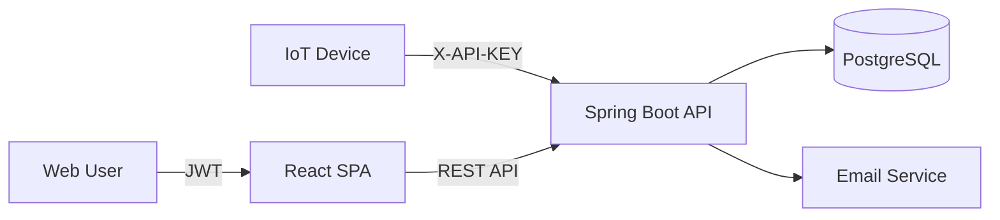

# Water Quality Monitoring System

Nền tảng giám sát chất lượng nước theo mô hình SaaS đa nhà máy, kết hợp backend Spring Boot, frontend React và cơ sở dữ liệu PostgreSQL để theo dõi dữ liệu cảm biến, quản lý thiết bị và phân quyền truy cập theo vai trò.

## Tổng quan

Dự án được xây dựng cho bối cảnh nhà máy xử lý nước hoặc hệ thống IoT công nghiệp, nơi dữ liệu từ thiết bị được đẩy lên backend qua API key, sau đó hiển thị trên dashboard cho người dùng đăng nhập bằng JWT. Hệ thống hỗ trợ đa tenant theo `factory_id`, cho phép tách biệt dữ liệu giữa các nhà máy trong cùng một ứng dụng.

### Mục tiêu chính

- Giám sát dữ liệu cảm biến theo thời gian gần thực.
- Quản lý người dùng, thiết bị và phân quyền theo nhà máy.
- Điều khiển trạng thái thiết bị và cấu hình vận hành từ giao diện web.
- Cung cấp API rõ ràng để tích hợp với thiết bị ESP32/ESP8266 hoặc hệ thống IoT tương tự.

## Tính năng chính

### Xác thực và phân quyền

- Đăng nhập người dùng bằng username/password và phát hành JWT.
- Xác thực thiết bị IoT bằng `X-API-KEY`.
- Phân quyền theo vai trò `ADMIN` và `EMPLOYEE`.
- Giới hạn dữ liệu theo nhà máy thông qua tenant context.

### Giám sát dữ liệu cảm biến

- Ghi nhận dữ liệu pH, nhiệt độ, độ đục và TDS.
- Dashboard cập nhật theo cơ chế polling mỗi 10 giây.
- Biểu đồ xu hướng và bảng dữ liệu mới nhất cho từng thiết bị.
- Trang lịch sử cho phép lọc theo thiết bị, khoảng thời gian và số lượng bản ghi.

### Quản lý thiết bị

- Tạo, cập nhật, xóa thiết bị.
- Sinh API key tự động cho thiết bị mới.
- Gán và hủy gán thiết bị cho nhân viên.
- Quản lý cài đặt thiết bị gồm trạng thái van, trạng thái thu thập dữ liệu và chu kỳ gửi dữ liệu.

### Quản lý người dùng

- Tạo, cập nhật, xóa người dùng trong phạm vi nhà máy.
- Đổi mật khẩu với kiểm tra mật khẩu hiện tại.
- Người dùng có thể cập nhật hồ sơ cá nhân.

### Cảnh báo và vận hành

- Kiểm tra ngưỡng dữ liệu ngay khi hệ thống nhận bản ghi cảm biến mới.
- Gửi email cảnh báo cho các tài khoản liên quan trong nhà máy.
- Hỗ trợ điều khiển van nước, bật/tắt thu thập dữ liệu và thay đổi chu kỳ gửi dữ liệu từ giao diện web.

## Kiến trúc hệ thống


```mermaid
flowchart LR
  Device[IoT Device] -->|X-API-KEY| Backend[Spring Boot API]
  User[Web User] -->|JWT| Frontend[React SPA]
  Frontend -->|REST API| Backend
  Backend --> Database[(PostgreSQL)]
  Backend --> Mail[Email Service]
```

### Luồng chính

1. Người dùng đăng nhập trên web và nhận JWT.
2. Frontend gọi API để tải dashboard, thiết bị, người dùng và lịch sử dữ liệu.
3. Thiết bị gửi dữ liệu cảm biến lên backend qua API key.
4. Backend lưu dữ liệu, kiểm tra cảnh báo và cập nhật trạng thái hiển thị.
5. Dữ liệu được tách theo nhà máy để đảm bảo isolation giữa các tenant.

## Mô hình phân quyền

| Vai trò    | Quyền chính                                                                                                                     |
| ---------- | ------------------------------------------------------------------------------------------------------------------------------- |
| `ADMIN`    | Quản lý người dùng, thiết bị, cài đặt thiết bị, phân quyền thiết bị và xem toàn bộ dữ liệu trong nhà máy                        |
| `EMPLOYEE` | Xem dữ liệu của thiết bị được cấp quyền, theo dõi dashboard, điều khiển thiết bị trong phạm vi cho phép, cập nhật hồ sơ cá nhân |

## Frontend

Ứng dụng frontend là một SPA xây dựng bằng React và Vite. Các trang chính gồm:

- Đăng nhập.
- Dashboard tổng quan.
- Lịch sử dữ liệu.
- Hồ sơ cá nhân.
- Quản lý người dùng dành cho ADMIN.
- Quản lý thiết bị dành cho ADMIN.

Các thành phần đáng chú ý:

- Biểu đồ thời gian thực với Chart.js.
- Thẻ metric hiển thị giá trị cảm biến và ngưỡng tham chiếu.
- Bảng dữ liệu mới nhất.
- Khối điều khiển thiết bị và thông báo cảnh báo.

## Backend

Backend được tổ chức theo các lớp chính:

- `controller`: REST API cho xác thực, người dùng, thiết bị, dữ liệu cảm biến và điều khiển.
- `service`: xử lý nghiệp vụ, phân quyền, cảnh báo, cài đặt thiết bị và JWT.
- `repository`: truy cập dữ liệu bằng Spring Data JPA.
- `model`: thực thể `User`, `Factory`, `Device`, `SensorData`, `DeviceSettings` và quan hệ cấp quyền.
- `config`: bảo mật, API key filter, JWT filter, tenant context và dữ liệu khởi tạo.

## API chính

### Xác thực

- `POST /api/auth/login`
- `GET /api/auth/me`

### Người dùng

- `GET /api/users`
- `POST /api/users`
- `GET /api/users/{id}`
- `PUT /api/users/{id}`
- `PUT /api/users/{id}/password`
- `DELETE /api/users/{id}`

### Thiết bị

- `GET /api/devices`
- `POST /api/devices`
- `GET /api/devices/{id}`
- `PUT /api/devices/{id}`
- `DELETE /api/devices/{id}`
- `POST /api/devices/{deviceId}/assign`
- `POST /api/devices/{deviceId}/unassign`
- `GET /api/devices/{deviceId}/settings`
- `PUT /api/devices/{deviceId}/settings`

### Điều khiển thiết bị

- `POST /api/controls/devices/{deviceId}/valve`
- `PUT /api/controls/devices/{deviceId}/interval`
- `PUT /api/controls/devices/{deviceId}/collecting`

### Dữ liệu cảm biến

- `POST /api/sensor-data`
- `GET /api/sensor-data/history/{deviceId}`

### Tài liệu API

- Swagger UI: `http://localhost:8080/swagger-ui/index.html`

## Công nghệ sử dụng

### Backend

| Công nghệ         | Phiên bản / ghi chú |
| ----------------- | ------------------- |
| Java              | 17                  |
| Spring Boot       | 3.5.6               |
| Spring Security   | 6.x                 |
| Spring Data JPA   | 3.x                 |
| Hibernate         | 6.x                 |
| PostgreSQL        | 16                  |
| JWT               | JJWT 0.11.5         |
| Spring Mail       | Email cảnh báo      |
| Spring AOP        | Tenant filtering    |
| SpringDoc OpenAPI | 2.6.0               |
| Gradle            | Wrapper đi kèm      |

### Frontend

| Công nghệ       | Phiên bản / ghi chú |
| --------------- | ------------------- |
| React           | 19.1.1              |
| Vite            | 7.1.7               |
| React Router    | 7.9.4               |
| Axios           | 1.12.2              |
| Chart.js        | 4.5.1               |
| react-chartjs-2 | 5.3.0               |
| Tailwind CSS    | 3.4.18              |
| date-fns        | 4.1.0               |
| jwt-decode      | 4.0.0               |

## Yêu cầu hệ thống

- JDK 17 trở lên.
- Node.js 18 trở lên.
- Docker và Docker Compose.
- PostgreSQL 16 nếu không chạy bằng container.

## Cài đặt và chạy local

### 1. Backend

```bash
cd backend
docker-compose up -d
./gradlew bootRun
```

Backend mặc định chạy tại `http://localhost:8080`.

### 2. Frontend

```bash
cd frontend
npm install
npm run dev
```

Frontend mặc định chạy tại `http://localhost:5173`.

### 3. Cấu hình biến môi trường cho frontend

Tạo file `frontend/.env`:

```env
VITE_API_BASE_URL=http://localhost:8080
```

### 4. Cấu hình backend tối thiểu

Tạo hoặc cập nhật `backend/src/main/resources/application.properties` theo môi trường triển khai của bạn. Các nhóm cấu hình quan trọng gồm:

- datasource PostgreSQL.
- JWT secret.
- SMTP mail nếu muốn gửi cảnh báo email.
- port server.

## Dữ liệu mẫu

Khi khởi động lần đầu, hệ thống tự tạo dữ liệu mẫu cho hai nhà máy:

| Nhà máy   | Tài khoản   | Mật khẩu   | Vai trò    |
| --------- | ----------- | ---------- | ---------- |
| Factory A | `adminA`    | `admin`    | `ADMIN`    |
| Factory A | `employeeA` | `employee` | `EMPLOYEE` |
| Factory B | `adminB`    | `admin`    | `ADMIN`    |
| Factory B | `employeeB` | `employee` | `EMPLOYEE` |

## Mô phỏng thiết bị IoT

Thư mục `fake-data/` chứa script mô phỏng thiết bị gửi dữ liệu cảm biến lên backend. Đây là công cụ phù hợp để kiểm thử luồng nhận dữ liệu và cảnh báo mà không cần phần cứng thật.

## Kiểm thử

### Backend

```bash
cd backend
./gradlew test
```

### Frontend

```bash
cd frontend
npm run lint
npm run build
```

### Tập lệnh kiểm thử

- `backend/test_apis.sh`
- `backend/test_multi_tenancy.sh`
- `backend/test_employee_permissions.sh`
- `backend/test_device_control.sh`

## Ghi chú phạm vi hiện tại

- Dashboard đang dùng polling định kỳ, chưa triển khai WebSocket.
- Cảnh báo được gửi qua email, chưa có bảng lưu lịch sử cảnh báo riêng.
- Hệ thống tập trung vào đọc dữ liệu, phân quyền và điều khiển thiết bị trong phạm vi nhà máy.

## Cấu trúc thư mục

```text
Water-Quality-Monitoring-System/
├── backend/      Spring Boot backend, API, security, persistence, tests
├── frontend/     React SPA, dashboard, management pages, API client
├── fake-data/    Script mô phỏng thiết bị IoT
└── README.md     Tài liệu tổng quan dự án
```

## Thông điệp dự án

Đây là một dự án phù hợp để giới thiệu với nhà tuyển dụng vì thể hiện đầy đủ các mảng kỹ thuật quan trọng: kiến trúc multi-tenant, Spring Security, JWT/API key authentication, quản lý trạng thái thiết bị IoT, dashboard dữ liệu thời gian gần thực và giao diện quản trị tương đối hoàn chỉnh.
