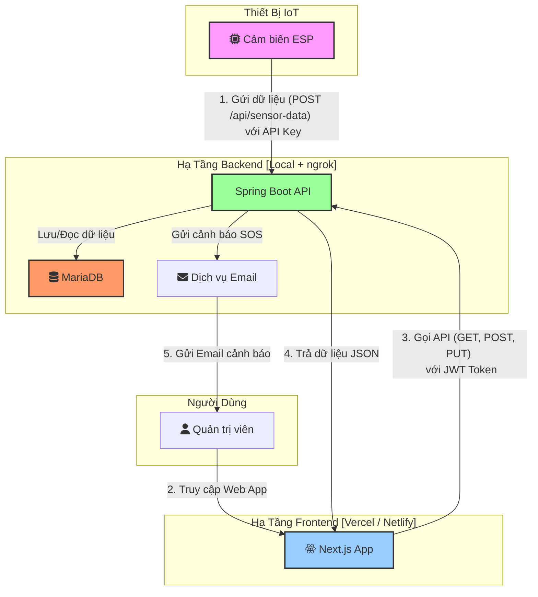

# 1. Công Nghệ Sử Dụng (Technology Stack)

Dự án sẽ được phát triển dựa trên các công nghệ được lựa chọn sau:

-   **Backend:** **Java (Spring Boot)** - Framework mạnh mẽ, phổ biến trong hệ sinh thái Java, cung cấp cấu trúc vững chắc để xây dựng các API RESTful hiệu suất cao và an toàn.
-   **Frontend:** **JavaScript/TypeScript (Next.js)** - React framework cho phép xây dựng giao diện người dùng hiện đại, có khả năng render phía máy chủ (SSR) giúp tối ưu hiệu năng.
-   **Database:** **MariaDB** - Hệ quản trị cơ sở dữ liệu quan hệ (RDBMS) mã nguồn mở, tương thích cao với MySQL, đảm bảo tính toàn vẹn và nhất quán của dữ liệu.

**Lưu ý về "real-time":** Trong giai đoạn đầu, hệ thống sẽ chưa sử dụng giao thức real-time chuyên dụng (như WebSocket). Thay vào đó, giao diện sẽ triển khai cơ chế **polling** (tự động gọi API sau mỗi 10-15 giây) để làm mới dữ liệu, đáp ứng yêu cầu giám sát gần thời gian thực.

# 2. Kiến Trúc Hệ Thống

### 2.1. Mô hình kiến trúc

Hệ thống được thiết kế theo kiến trúc client-server.
**Phương án triển khai cho dự án:** **Triển khai tách biệt**

- **Frontend:** Triển khai trên nền tảng miễn phí (Vercel, Netlify) để có URL công khai.
- **Backend:** Chạy local và sử dụng tunnel (ngrok) để tạo URL/IP cho phép frontend và thiết bị IoT truy cập.

Sơ đồ dưới đây minh họa kiến trúc tổng thể của hệ thống:



### 2.2. Mô Hình Hóa Dữ Liệu (Database Schema)

Cơ sở dữ liệu sử dụng là **MariaDB**. Dưới đây là cấu trúc cho các bảng chính:

**1. Bảng `users`**
-   Lưu trữ thông tin đăng nhập và vai trò của người dùng.

```sql
CREATE TABLE users (
    id INT AUTO_INCREMENT PRIMARY KEY,
    username VARCHAR(50) NOT NULL UNIQUE,
    password_hash VARCHAR(255) NOT NULL, -- Sẽ được hash bằng bcrypt
    email VARCHAR(100) NOT NULL UNIQUE,
    role VARCHAR(20) DEFAULT 'ADMIN',    -- Mặc định là Admin theo yêu cầu
    created_at TIMESTAMP DEFAULT CURRENT_TIMESTAMP
);
```

**2. Bảng `sensor_data`**
-   Lưu trữ dữ liệu lịch sử từ cảm biến. Thêm `device_id` để có thể mở rộng cho nhiều thiết bị trong tương lai.

```sql
CREATE TABLE sensor_data (
    id BIGINT AUTO_INCREMENT PRIMARY KEY,
    device_id VARCHAR(50) NOT NULL DEFAULT 'default_esp',
    ph DECIMAL(4, 2),
    temperature DECIMAL(5, 2),
    doDuc DECIMAL(10, 2),       -- Độ đục (Turbidity)
    doDanDien DECIMAL(10, 2),   -- Độ dẫn điện (Conductivity)
    timestamp TIMESTAMP NOT NULL, -- Thời gian do ESP gửi lên
    created_at TIMESTAMP DEFAULT CURRENT_TIMESTAMP -- Thời gian lưu vào DB
);
```

**3. Bảng `system_settings`**
-   Lưu trữ các cấu hình động của hệ thống để duy trì trạng thái.

```sql
CREATE TABLE system_settings (
    setting_key VARCHAR(50) PRIMARY KEY,
    setting_value VARCHAR(255) NOT NULL,
    updated_at TIMESTAMP DEFAULT CURRENT_TIMESTAMP ON UPDATE CURRENT_TIMESTAMP
);

-- Khởi tạo các giá trị mặc định
INSERT INTO system_settings (setting_key, setting_value) VALUES
('valve_status', 'closed'),
('collection_enabled', 'true'),
('collection_interval_seconds', '60');
```

### 2.3. Cơ Chế Giao Tiếp Gần Thời Gian Thực (Polling)

Để đáp ứng yêu cầu hiển thị dữ liệu và cảnh báo mới trên giao diện mà không cần người dùng tải lại trang, hệ thống sẽ áp dụng cơ chế **HTTP Polling**.

*   **Cách hoạt động:**
    1.  Sau khi người dùng đăng nhập và truy cập trang dashboard, giao diện frontend (Next.js) sẽ tự động gửi một yêu cầu đến API (ví dụ: `GET /api/sensor-data/latest`) để lấy dữ liệu mới nhất.
    2.  Frontend sẽ lặp lại việc gọi API này sau một khoảng thời gian cố định (ví dụ: **15 giây**).
    3.  Mỗi khi nhận được dữ liệu mới, giao diện sẽ tự động cập nhật lại biểu đồ và danh sách cảnh báo.

*   **Ưu điểm:**
    *   Đơn giản, dễ triển khai với kiến trúc REST API hiện tại.
    *   Không yêu cầu hạ tầng phức tạp.

*   **Nhược điểm:**
    *   Có độ trễ (phụ thuộc vào tần suất polling).
    *   Tạo ra nhiều request không cần thiết nếu không có dữ liệu mới.

Cơ chế này hoàn toàn phù hợp với giai đoạn đầu của dự án. Trong tương lai, nếu có yêu cầu về real-time tuyệt đối, hệ thống có thể được nâng cấp lên sử dụng WebSocket.
### 2.4. Công cụ Build và Quản lý Phụ thuộc

-   **Backend (Spring Boot):** Dự án sử dụng **Gradle** làm công cụ build và quản lý các thư viện phụ thuộc. File `build.gradle` ở thư mục gốc của backend sẽ định nghĩa tất cả các dependency cần thiết.
-   **Frontend (Next.js):** Sử dụng **NPM (Node Package Manager)** để quản lý các thư viện.

### 2.5. Quản lý Biến Môi Trường

Để đảm bảo tính bảo mật và linh hoạt trong cấu hình, dự án không lưu các thông tin nhạy cảm (như mật khẩu, secret key) trực tiếp trong code. Thay vào đó, chúng được quản lý thông qua biến môi trường.

**Backend:**
-   Sử dụng file `application-local.properties` (không commit lên Git) để ghi đè các cấu hình cho môi trường local.
-   Các biến môi trường chính:
    -   `spring.datasource.url`: URL kết nối tới database.
    -   `spring.datasource.username`: Tên đăng nhập database.
    -   `spring.datasource.password`: Mật khẩu database.
    -   `jwt.secret`: Chuỗi bí mật để ký và xác thực JWT.
    -   `esp.api-key`: API Key dành cho thiết bị ESP.
    -   `spring.mail.*`: Các cấu hình để gửi email (host, port, username, password).

**Frontend:**
-   Sử dụng file `.env.local` (không commit lên Git).
-   Các biến môi trường chính:
    -   `NEXT_PUBLIC_API_BASE_URL`: Địa chỉ API public của backend (từ ngrok).
