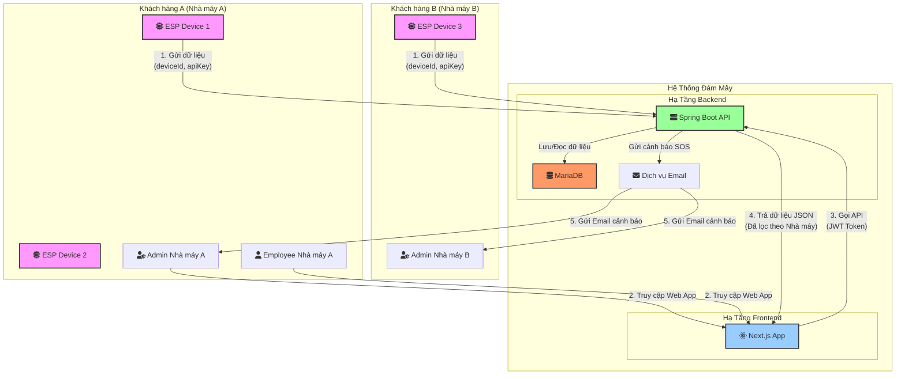

# 1. Công Nghệ Sử Dụng (Technology Stack)

Dự án sẽ được phát triển dựa trên các công nghệ được lựa chọn sau:

-   **Backend:** **Java (Spring Boot)** - Framework mạnh mẽ, phổ biến trong hệ sinh thái Java, cung cấp cấu trúc vững chắc để xây dựng các API RESTful hiệu suất cao và an toàn.
-   **Frontend:** **JavaScript/TypeScript (Next.js)** - React framework cho phép xây dựng giao diện người dùng hiện đại, có khả năng render phía máy chủ (SSR) giúp tối ưu hiệu năng.
-   **Database:** **MariaDB** - Hệ quản trị cơ sở dữ liệu quan hệ (RDBMS) mã nguồn mở, tương thích cao với MySQL, đảm bảo tính toàn vẹn và nhất quán của dữ liệu.

**Lưu ý về "real-time":** Trong giai đoạn đầu, hệ thống sẽ chưa sử dụng giao thức real-time chuyên dụng (như WebSocket). Thay vào đó, giao diện sẽ triển khai cơ chế **polling** (tự động gọi API sau mỗi 10-15 giây) để làm mới dữ liệu, đáp ứng yêu cầu giám sát gần thời gian thực.

# 2. Kiến Trúc Hệ Thống

### 2.1. Mô hình kiến trúc

Hệ thống được thiết kế theo kiến trúc **Client-Server** và áp dụng mô hình **đa người dùng (multi-tenant)**.

**Phương án triển khai cho dự án:** **Triển khai trên Cloud**
- **Frontend:** Triển khai trên các nền tảng như Vercel hoặc Netlify.
- **Backend & Database:** Triển khai trên một nhà cung cấp dịch vụ đám mây (ví dụ: AWS, Azure, Google Cloud) để đảm bảo tính sẵn sàng và khả năng mở rộng. Việc sử dụng `ngrok` chỉ còn là giải pháp tạm thời cho môi trường phát triển.

Sơ đồ dưới đây minh họa kiến trúc tổng thể của hệ thống:



### 2.2. Mô Hình Hóa Dữ Liệu (Database Schema)

Để hỗ trợ mô hình đa người dùng, cấu trúc CSDL được điều chỉnh để đảm bảo dữ liệu của mỗi "Nhà máy" (tenant) được cách ly.

**1. Bảng `factories` (MỚI)**
-   Lưu trữ thông tin về các khách hàng (nhà máy).

```sql
CREATE TABLE factories (
    id INT AUTO_INCREMENT PRIMARY KEY,
    name VARCHAR(100) NOT NULL,
    address TEXT,
    created_at TIMESTAMP DEFAULT CURRENT_TIMESTAMP
);
```

**2. Bảng `users` (Cập nhật)**
-   Thêm `factory_id` để liên kết mỗi người dùng với một nhà máy.
-   Cập nhật `role` để bao gồm `ADMIN` và `EMPLOYEE`.

```sql
CREATE TABLE users (
    id INT AUTO_INCREMENT PRIMARY KEY,
    factory_id INT NOT NULL,
    username VARCHAR(50) NOT NULL,
    password_hash VARCHAR(255) NOT NULL,
    email VARCHAR(100) NOT NULL,
    role VARCHAR(20) NOT NULL, -- 'ADMIN' hoặc 'EMPLOYEE'
    created_at TIMESTAMP DEFAULT CURRENT_TIMESTAMP,
    
    UNIQUE(factory_id, username),
    UNIQUE(factory_id, email),
    FOREIGN KEY (factory_id) REFERENCES factories(id) ON DELETE CASCADE
);
```

**3. Bảng `devices` (MỚI)**
-   Lưu trữ thông tin về các thiết bị IoT và liên kết chúng với nhà máy.

```sql
CREATE TABLE devices (
    id INT AUTO_INCREMENT PRIMARY KEY,
    device_id VARCHAR(50) NOT NULL UNIQUE, -- ID vật lý của thiết bị
    name VARCHAR(100),
    factory_id INT NOT NULL,
    api_key VARCHAR(255) NOT NULL UNIQUE, -- API Key để xác thực
    created_at TIMESTAMP DEFAULT CURRENT_TIMESTAMP,
    
    FOREIGN KEY (factory_id) REFERENCES factories(id) ON DELETE CASCADE
);
```

**4. Bảng `employee_device_access` (MỚI)**
-   Bảng trung gian để định nghĩa quyền truy cập của `EMPLOYEE` vào các thiết bị.

```sql
CREATE TABLE employee_device_access (
    user_id INT NOT NULL,
    device_id INT NOT NULL,
    PRIMARY KEY (user_id, device_id),
    
    FOREIGN KEY (user_id) REFERENCES users(id) ON DELETE CASCADE,
    FOREIGN KEY (device_id) REFERENCES devices(id) ON DELETE CASCADE
);
```

**5. Bảng `sensor_data` (Cập nhật)**
-   Loại bỏ `device_id` vật lý, thay bằng `device_id` là khóa ngoại trỏ đến bảng `devices`.

```sql
CREATE TABLE sensor_data (
    id BIGINT AUTO_INCREMENT PRIMARY KEY,
    device_id INT NOT NULL,
    ph DECIMAL(4, 2),
    temperature DECIMAL(5, 2),
    doDuc DECIMAL(10, 2),
    doDanDien DECIMAL(10, 2),
    timestamp TIMESTAMP NOT NULL,
    created_at TIMESTAMP DEFAULT CURRENT_TIMESTAMP,
    
    FOREIGN KEY (device_id) REFERENCES devices(id) ON DELETE CASCADE
);
```

**6. Bảng `device_settings` (Thay thế `system_settings`)**
-   Lưu trữ cấu hình cho từng thiết bị thay vì toàn hệ thống.

```sql
CREATE TABLE device_settings (
    device_id INT PRIMARY KEY,
    valve_status VARCHAR(20) DEFAULT 'closed',
    collection_enabled BOOLEAN DEFAULT true,
    collection_interval_seconds INT DEFAULT 60,
    updated_at TIMESTAMP DEFAULT CURRENT_TIMESTAMP ON UPDATE CURRENT_TIMESTAMP,

    FOREIGN KEY (device_id) REFERENCES devices(id) ON DELETE CASCADE
);
```

### 2.3. Cơ Chế Giao Tiếp Gần Thời Gian Thực (Polling)

Để đáp ứng yêu cầu hiển thị dữ liệu và cảnh báo mới trên giao diện mà không cần người dùng tải lại trang, hệ thống sẽ áp dụng cơ chế **HTTP Polling**.

*   **Cách hoạt động:**
    1.  Sau khi người dùng đăng nhập và truy cập trang dashboard, giao diện frontend (Next.js) sẽ tự động gửi một yêu cầu đến API (ví dụ: `GET /api/sensor-data/latest`) để lấy dữ liệu mới nhất.
    2.  Frontend sẽ lặp lại việc gọi API này sau một khoảng thời gian cố định (ví dụ: **15 giây**).
    3.  Mỗi khi nhận được dữ liệu mới, giao diện sẽ tự động cập nhật lại biểu đồ và danh sách cảnh báo.

*   **Ưu điểm:**
    *   Đơn giản, dễ triển khai với kiến trúc REST API hiện tại.
    *   Không yêu cầu hạ tầng phức tạp.

*   **Nhược điểm:**
    *   Có độ trễ (phụ thuộc vào tần suất polling).
    *   Tạo ra nhiều request không cần thiết nếu không có dữ liệu mới.

Cơ chế này hoàn toàn phù hợp với giai đoạn đầu của dự án. Trong tương lai, nếu có yêu cầu về real-time tuyệt đối, hệ thống có thể được nâng cấp lên sử dụng WebSocket.
### 2.4. Công cụ Build và Quản lý Phụ thuộc

-   **Backend (Spring Boot):** Dự án sử dụng **Gradle** làm công cụ build và quản lý các thư viện phụ thuộc. File `build.gradle` ở thư mục gốc của backend sẽ định nghĩa tất cả các dependency cần thiết.
-   **Frontend (Next.js):** Sử dụng **NPM (Node Package Manager)** để quản lý các thư viện.

### 2.5. Quản lý Biến Môi Trường

Để đảm bảo tính bảo mật và linh hoạt trong cấu hình, dự án không lưu các thông tin nhạy cảm (như mật khẩu, secret key) trực tiếp trong code. Thay vào đó, chúng được quản lý thông qua biến môi trường.

**Backend:**
-   Sử dụng file `application-local.properties` (không commit lên Git) để ghi đè các cấu hình cho môi trường local.
-   Các biến môi trường chính:
    -   `spring.datasource.url`: URL kết nối tới database.
    -   `spring.datasource.username`: Tên đăng nhập database.
    -   `spring.datasource.password`: Mật khẩu database.
    -   `jwt.secret`: Chuỗi bí mật để ký và xác thực JWT.
    -   `esp.api-key`: (Sẽ được thay thế bằng cơ chế quản lý API key theo từng thiết bị trong bảng `devices`).
    -   `spring.mail.*`: Các cấu hình để gửi email (host, port, username, password).

**Frontend:**
-   Sử dụng file `.env.local` (không commit lên Git).
-   Các biến môi trường chính:
    -   `NEXT_PUBLIC_API_BASE_URL`: Địa chỉ API public của backend (từ ngrok).
